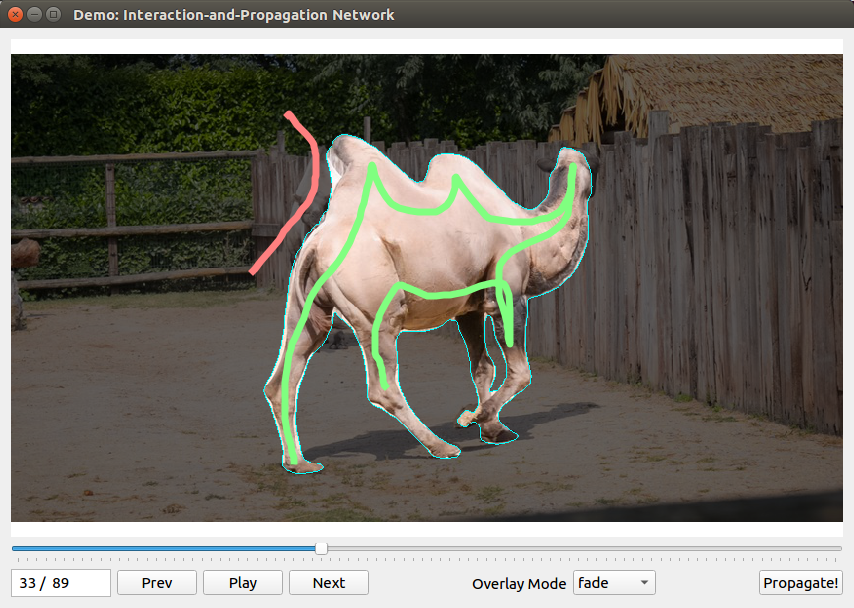

# Fast User-Guided Video Object Segmentation by Interaction-and-Propagation Networks
### Seoung Wug Oh, Joon-Young Lee, Ning Xu, Seon Joo Kim
### CVPR 2019



Demo code with GUI interface.  
[paper](https://arxiv.org/abs/1904.09791)


### Requirements
- python 3.6
- pytorch 0.3.1
- [davisinteractive](https://github.com/albertomontesg/davis-interactive)
- matplotlib
- PyQt5

### How to Use
##### Environment setup
```
conda create --name ivs python=3.6
source activate ivs

pip install PyQt5 matplotlib opencv-contrib-python pillow Cython
pip install davisinteractive

conda install pytorch=0.3.1 cuda90 -c pytorch
conda install torchvision
```

##### Download weights
```
wget -O I_e290.pth "https://www.dropbox.com/s/khx9hmtnqbzg634/I_e290.pth?dl=1"
wget -O P_e290.pth "https://www.dropbox.com/s/89heglbglig0g04/P_e290.pth?dl=1"
```

##### Run!
``` 
python gui.py -seq camel 
```

##### Test your own videos
Locate videos in ```./sequences/[name]```
Run 
``` 
python gui.py -seq [name]
```


### Quantitative Evaluation
The GUI application in this repository is only for demo.
The numbers in our paper will not be reproducable with the checkpoint included here.
If you are interested in quantitative evaluation using [DAVIS framework](https://interactive.davischallenge.org/).

Please contact me by E-mail.


### Reference 
If you find our paper and repo useful, please cite our paper. Thanks!
``` 
Fast User-Guided Video Object Segmentation by Interaction-and-Propagation Networks
Seoung Wug Oh, Joon-Young Lee, Ning Xu, Seon Joo Kim
CVPR 2019
```

### Terms of Use
This software is for non-commercial use only.
The source code is released under the Attribution-NonCommercial-ShareAlike (CC BY-NC-SA) Licence
(see [this](https://creativecommons.org/licenses/by-nc-sa/4.0/legalcode) for details)
